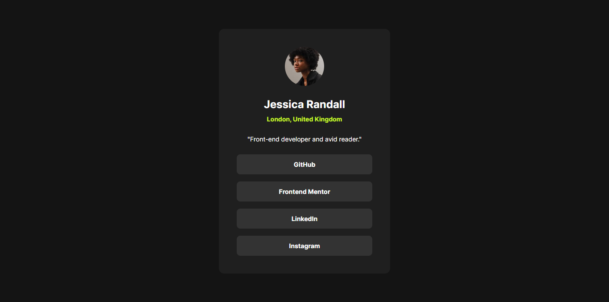

# Frontend Mentor - Social links profile solution

This is a solution to the [Social links profile challenge on Frontend Mentor](https://www.frontendmentor.io/challenges/social-links-profile-UG32l9m6dQ). Frontend Mentor challenges help you improve your coding skills by building realistic projects.

## Table of contents

- [Overview](#overview)
  - [The challenge](#the-challenge)
  - [Screenshot](#screenshot)
  - [Links](#links)
- [My process](#my-process)
  - [Built with](#built-with)
  - [What I learned](#what-i-learned)
  - [Continued development](#continued-development)
  - [Useful resources](#useful-resources)

## Overview

### The challenge

Users should be able to:

- See hover and focus states for all interactive elements on the page

### Screenshot



### Links

- Solution URL: [the solution URL here](https://github.com/Mohammed-Osama-pg/FdMr-Social-links-profile.git)
- Live Site URL: [the live site URL here](https://mohammed-osama-pg.github.io/FdMr-Social-links-profile/)

## My process

### Built with

- Semantic HTML5 markup
- SASS for CSS
- Flexbox
- Mobile-first workflow

### What I learned

How to work with SASS functions

```SCSS
@use "sass:math";
@function rem($px) {
  @if (unitless($px)) {
    @warn "Assuming #{$px} to be in pixels, attempting to convert it to a number.";
    @return #{$px / 16}rem;
  }
}
@function em($px, $context) {
  @if (unitless($px)) {
    @warn "Assuming #{$px} to be in pixels, attempting to convert it to a number.";
    @return #{$px / $context}em;
  }
}
```

how to navigate the links only using the keyboard

### Useful resources

- [how to navigate the links only using the keyboard:](https://whoishostingthis.com/how-to-create-a-website/how-to-make-your-website-accessible-for-keyboard-only-visitors/).
